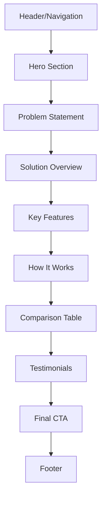

# TubeFlow Landing Page Improvement Plan

## Executive Summary

This document provides a comprehensive analysis and improvement plan for the TubeFlow landing page. The current implementation is branded as "UseNotes" (a note-taking app) but needs to be transformed to communicate TubeFlow's core value proposition: a better YouTube content consumption experience with thematic playlists, full subscription control, and intuitive organization.

---

## Current State Analysis

### Existing Structure
The landing page ([`apps/web/src/app/page.tsx`](apps/web/src/app/page.tsx:1)) consists of:
1. **Header** - Navigation with bottom-fixed positioning
2. **Hero Section** - Main headline and CTA
3. **Benefits Section** - 4 benefit cards
4. **Testimonials Section** - 3 user reviews
5. **Footer Hero** - Secondary CTA
6. **Footer** - Site links and copyright

### Critical Issues Identified

#### 1. **Brand Misalignment**
- All copy references "UseNotes" (note-taking app)
- Hero headline: "The Ultimate Note-Taking Experience"
- No mention of YouTube, playlists, or video content
- Benefits focus on AI note-taking, not video consumption

#### 2. **Missing Value Proposition**
- Doesn't communicate YouTube pain points
- No explanation of thematic playlists
- Missing subscription control messaging
- No differentiation from YouTube

#### 3. **Weak Copywriting**
- Generic phrases: "harnesses power of artificial intelligence"
- No emotional connection to user frustrations
- Benefits are feature-focused, not outcome-focused
- CTAs lack specificity ("Get Started" is vague)

#### 4. **Poor Information Hierarchy**
- Doesn't lead with the problem
- No clear problem → solution → benefit flow
- Missing social proof specific to video consumption
- No visual demonstration of the product's unique features

---

## Improved Information Architecture

### Recommended Page Structure



### Section Breakdown

#### 1. **Hero Section** (Above the fold)
- **Purpose**: Capture attention with clear value proposition
- **Elements**: 
  - Compelling headline addressing YouTube frustration
  - Subheadline explaining the solution
  - Primary CTA
  - Hero image/video showing the interface

#### 2. **Problem Statement** (New section)
- **Purpose**: Validate user pain points
- **Elements**:
  - 3-4 specific YouTube frustrations
  - Visual icons representing each problem
  - Emotional language that resonates

#### 3. **Solution Overview** (New section)
- **Purpose**: Position TubeFlow as the answer
- **Elements**:
  - Clear explanation of thematic playlists
  - Subscription control features
  - Intuitive organization benefits

#### 4. **Key Features** (Replaces Benefits)
- **Purpose**: Demonstrate specific capabilities
- **Elements**:
  - 4-6 feature cards with screenshots
  - Focus on outcomes, not features
  - Visual demonstrations

#### 5. **How It Works** (New section)
- **Purpose**: Reduce friction and build confidence
- **Elements**:
  - 3-step process
  - Simple illustrations
  - Emphasize ease of use

#### 6. **Comparison Table** (New section)
- **Purpose**: Highlight advantages over YouTube
- **Elements**:
  - Side-by-side comparison
  - TubeFlow vs YouTube
  - Clear visual differentiation

#### 7. **Testimonials** (Enhanced)
- **Purpose**: Build trust and credibility
- **Elements**:
  - Video-specific testimonials
  - Specific outcomes achieved
  - Diverse user types

#### 8. **Final CTA** (Enhanced Footer Hero)
- **Purpose**: Convert visitors
- **Elements**:
  - Urgency or incentive
  - Clear next steps
  - Risk reduction (free trial, no credit card)

---

## Improved Copywriting

### Hero Section

#### Headline Options:
1. **"Take Back Control of Your YouTube Experience"**
   - Direct, empowering, addresses control issue

2. **"Watch YouTube Your Way, Not YouTube's Way"**
   - Confrontational, clear differentiation

3. **"Stop Fighting YouTube's Algorithm. Start Enjoying Your Content."**
   - Problem-focused, solution-implied

**Recommended**: Option 3 - Most emotionally resonant

#### Subheadline:
"TubeFlow gives you the YouTube experience you deserve: organized thematic playlists, full subscription control, and zero algorithmic interference. Just your content, your way."

#### Primary CTA:
"Start Watching Better" (instead of generic "Get Started")

---

### Problem Statement Section

#### Headline:
"YouTube Wasn't Built for You"

#### Problem Cards:

**1. Algorithmic Tyranny**
- **Icon**: 🎯 Target/Algorithm symbol
- **Copy**: "YouTube forces suggested videos you never asked for, derailing your viewing experience and wasting your time."

**2. Playlist Chaos**
- **Icon**: 📋 Messy playlist
- **Copy**: "Creating and managing playlists is clunky and non-intuitive. Finding what you saved feels like searching for a needle in a haystack."

**3. Subscription Overload**
- **Icon**: 📺 Overwhelmed screen
- **Copy**: "You're subscribed to dozens of channels, but YouTube decides what you see. Your subscriptions feel invisible and unmanageable."

**4. Lost in the Feed**
- **Icon**: 🌊 Drowning in content
- **Copy**: "The endless feed prioritizes engagement over your interests. You spend more time scrolling than watching what you actually care about."

---

### Solution Overview Section

#### Headline:
"Meet TubeFlow: YouTube, Reimagined"

#### Subheadline:
"We built the YouTube experience that should have existed from day one."

#### Three Core Pillars:

**1. Thematic Playlists That Make Sense**
"Organize your content by themes, topics, or moods. Create 'Morning Motivation,' 'Deep Learning,' or 'Weekend Cooking' playlists that actually work the way you think."

**2. Full Subscription Visibility & Control**
"See all your subscriptions at a glance. Filter, sort, and organize them however you want. Never miss content from creators you actually care about."

**3. Zero Algorithmic Interference**
"Your feed shows what YOU choose, not what an algorithm thinks will keep you clicking. Take back control of your attention."

---

### Key Features Section

#### Headline:
"Everything You Need, Nothing You Don't"

#### Feature Cards:

**1. Smart Thematic Organization**
- **Visual**: Screenshot of themed playlists
- **Headline**: "Organize by Theme, Not Just Channel"
- **Copy**: "Group videos from multiple creators around topics you care about. Build your own learning paths, entertainment queues, or inspiration libraries."
- **Benefit Tag**: "Find what you need in seconds"

**2. Subscription Dashboard**
- **Visual**: Screenshot of subscription management
- **Headline**: "See Every Channel You Follow"
- **Copy**: "A clean, organized view of all your subscriptions. Sort by upload frequency, last watched, or custom categories. Never lose track of your favorite creators."
- **Benefit Tag**: "Stay connected to what matters"

**3. Distraction-Free Viewing**
- **Visual**: Clean interface screenshot
- **Headline**: "Watch Without Interruption"
- **Copy**: "No suggested videos pulling you away. No autoplay to random content. Just your curated playlists and intentional viewing."
- **Benefit Tag**: "Reclaim your time and focus"

**4. Intelligent Search & Filtering**
- **Visual**: Search interface
- **Headline**: "Find Anything, Instantly"
- **Copy**: "Search across all your saved content, playlists, and subscriptions. Filter by duration, date, channel, or custom tags."
- **Benefit Tag**: "Your content library, searchable"

**5. Cross-Device Sync**
- **Visual**: Multi-device illustration
- **Headline**: "Start on Phone, Finish on Desktop"
- **Copy**: "Your playlists, watch history, and preferences sync seamlessly across all your devices. Pick up exactly where you left off."
- **Benefit Tag**: "Watch anywhere, anytime"

**6. Privacy-First Design**
- **Visual**: Privacy shield icon
- **Headline**: "Your Data Stays Yours"
- **Copy**: "We don't track your viewing habits for advertising. No data selling. No creepy recommendations. Just a tool that works for you."
- **Benefit Tag**: "Watch with peace of mind"

---

### How It Works Section

#### Headline:
"Get Started in 3 Simple Steps"

#### Steps:

**Step 1: Connect Your YouTube Account**
- **Icon**: 🔗 Connection symbol
- **Copy**: "Securely link your YouTube account. We'll import your subscriptions and saved playlists."
- **Time**: "Takes 30 seconds"

**Step 2: Create Your First Thematic Playlist**
- **Icon**: ✨ Creation sparkle
- **Copy**: "Start organizing videos by theme. Drag and drop content from any channel into custom playlists."
- **Time**: "5 minutes to organize"

**Step 3: Enjoy YouTube Your Way**
- **Icon**: 🎉 Celebration
- **Copy**: "Browse your organized library, watch distraction-free, and never fight the algorithm again."
- **Time**: "Forever better"

---

### Comparison Table Section

#### Headline:
"TubeFlow vs. YouTube: The Difference Is Clear"

| Feature | YouTube | TubeFlow |
|---------|---------|----------|
| **Content Discovery** | Algorithm-driven suggestions | Your curated playlists |
| **Playlist Management** | Basic, hard to organize | Thematic, intuitive organization |
| **Subscription Control** | Hidden, algorithm-filtered | Full visibility and control |
| **Viewing Experience** | Constant distractions | Distraction-free focus |
| **Search Capability** | Limited to YouTube's index | Search your entire library |
| **Data Privacy** | Tracked for advertising | Privacy-first, no tracking |
| **Interface** | Cluttered with suggestions | Clean, purposeful design |
| **Your Control** | Limited | Complete |

---

### Testimonials Section (Enhanced)

#### Headline:
"Loved by Intentional Viewers"

#### Testimonial Examples:

**Testimonial 1: The Learner**
- **Quote**: "I was drowning in educational content. TubeFlow helped me create learning paths for programming, design, and business. I've completed 3 full courses I'd been putting off for months."
- **Name**: Sarah Chen
- **Role**: Software Developer
- **Metric**: "Completed 3 courses in 2 months"

**Testimonial 2: The Creator**
- **Quote**: "As a content creator, I need to stay on top of my niche without getting sucked into YouTube's rabbit holes. TubeFlow lets me research competitors and trends without losing 3 hours to the algorithm."
- **Name**: Marcus Rodriguez
- **Role**: YouTube Creator (250K subs)
- **Metric**: "Saves 10+ hours weekly"

**Testimonial 3: The Parent**
- **Quote**: "I wanted my kids to watch educational content, not whatever YouTube's algorithm served up. TubeFlow gave me the control I needed to curate their viewing experience."
- **Name**: Jennifer Park
- **Role**: Parent & Educator
- **Metric**: "100% curated content"

---

### Final CTA Section

#### Headline:
"Ready to Transform Your YouTube Experience?"

#### Subheadline:
"Join thousands of viewers who've taken back control of their content consumption."

#### CTA Button:
"Start Your Free Trial" (with subtext: "No credit card required")

#### Trust Signals:
- ✓ Free 14-day trial
- ✓ Cancel anytime
- ✓ Import your data in seconds
- ✓ Works with your existing YouTube account

#### Secondary CTA:
"See How It Works" (link to demo video)

---

## Design & Layout Recommendations

### Visual Hierarchy

#### 1. **Typography Scale**
```
H1 (Hero): 60-75px (desktop), 36-44px (mobile)
H2 (Section Headers): 48-57px (desktop), 30-36px (mobile)
H3 (Subsections): 32-42px (desktop), 24-28px (mobile)
Body: 18-20px (desktop), 16-18px (mobile)
Small: 14-16px
```

#### 2. **Color Strategy**
- **Primary**: Keep existing blue (#primary) for CTAs and accents
- **Problem Sections**: Use subtle red/orange tints to convey frustration
- **Solution Sections**: Use green/blue tints to convey relief and control
- **Comparison Table**: Use contrasting backgrounds (gray for YouTube, white/blue for TubeFlow)

#### 3. **Spacing & Rhythm**
- Increase whitespace between sections (120-160px desktop, 80-100px mobile)
- Use consistent card padding (32-48px desktop, 24-32px mobile)
- Maintain visual breathing room around CTAs

### Component-Specific Recommendations

#### Hero Section
- **Layout**: Keep existing two-column layout
- **Image**: Replace note-taking mockup with TubeFlow interface showing:
  - Thematic playlists sidebar
  - Clean video player
  - No suggested videos clutter
- **Background**: Keep gradient but consider subtle video-related pattern

#### Problem Statement Section
- **Layout**: 2x2 grid (desktop), single column (mobile)
- **Cards**: 
  - Icon at top
  - Bold headline
  - 2-3 sentence description
  - Subtle shadow on hover
  - Red/orange accent color for icons

#### Solution Overview Section
- **Layout**: Three-column layout with large icons
- **Visual**: Consider animated illustrations showing the transformation
- **Background**: Light blue gradient to convey calm and control

#### Key Features Section
- **Layout**: Alternating left-right layout (image-text, text-image)
- **Images**: Actual product screenshots with annotations
- **Cards**: Remove current card style, use full-width sections
- **Benefit Tags**: Small colored badges highlighting key outcomes

#### How It Works Section
- **Layout**: Horizontal timeline (desktop), vertical (mobile)
- **Visual**: Connected steps with arrows
- **Icons**: Large, colorful, friendly
- **Background**: Subtle pattern or gradient

#### Comparison Table Section
- **Layout**: Responsive table with sticky header
- **Visual**: Checkmarks (✓) for TubeFlow, X marks (✗) for YouTube
- **Styling**: Alternating row colors, bold headers
- **Mobile**: Convert to accordion or card-based comparison

#### Testimonials Section
- **Layout**: Keep 3-column grid
- **Cards**: Add:
  - User photo (if available)
  - Star rating
  - Specific metric/outcome
  - Role/context
- **Background**: Keep existing gradient

#### Final CTA Section
- **Layout**: Centered, single-column
- **Visual**: Large, prominent CTA button
- **Trust Signals**: Icon list below CTA
- **Background**: Bold primary color with white text

---

## Component Structure Recommendations

### New Components to Create

#### 1. **ProblemCard Component**
```typescript
// apps/web/src/components/home/ProblemCard.tsx
interface ProblemCardProps {
  icon: string;
  title: string;
  description: string;
}
```

#### 2. **SolutionPillar Component**
```typescript
// apps/web/src/components/home/SolutionPillar.tsx
interface SolutionPillarProps {
  icon: string;
  title: string;
  description: string;
}
```

#### 3. **FeatureShowcase Component**
```typescript
// apps/web/src/components/home/FeatureShowcase.tsx
interface FeatureShowcaseProps {
  image: string;
  title: string;
  description: string;
  benefitTag: string;
  imagePosition: 'left' | 'right';
}
```

#### 4. **HowItWorksStep Component**
```typescript
// apps/web/src/components/home/HowItWorksStep.tsx
interface HowItWorksStepProps {
  stepNumber: number;
  icon: string;
  title: string;
  description: string;
  timeEstimate: string;
}
```

#### 5. **ComparisonTable Component**
```typescript
// apps/web/src/components/home/ComparisonTable.tsx
interface ComparisonRow {
  feature: string;
  youtube: string | boolean;
  tubeflow: string | boolean;
}
```

#### 6. **EnhancedTestimonial Component**
```typescript
// apps/web/src/components/home/EnhancedTestimonial.tsx
interface EnhancedTestimonialProps {
  quote: string;
  name: string;
  role: string;
  metric: string;
  image?: string;
  rating: number;
}
```

### Components to Modify

#### 1. **Hero.tsx**
- Update headline and subheadline text
- Replace hero image
- Update CTA button text
- Add secondary CTA option

#### 2. **Benefits.tsx** → Rename to **Features.tsx**
- Change from 2x2 grid to alternating full-width sections
- Add product screenshots
- Include benefit tags
- Update all copy

#### 3. **Testimonials.tsx**
- Add metric/outcome field
- Add role/context field
- Update testimonial data
- Enhance card design

#### 4. **FooterHero.tsx** → Rename to **FinalCTA.tsx**
- Add trust signals
- Update headline and copy
- Add secondary CTA
- Include free trial messaging

---

## Implementation Priority

### Phase 1: Critical Copy Updates (Immediate)
1. Update Hero section headline and subheadline
2. Update all "UseNotes" references to "TubeFlow"
3. Update CTA button text
4. Update Benefits section copy to focus on video consumption

### Phase 2: New Sections (High Priority)
1. Create Problem Statement section
2. Create Solution Overview section
3. Create How It Works section
4. Create Comparison Table section

### Phase 3: Component Enhancements (Medium Priority)
1. Enhance Features section with screenshots
2. Update Testimonials with video-specific examples
3. Enhance Final CTA with trust signals
4. Update hero image/mockup

### Phase 4: Visual Polish (Lower Priority)
1. Refine color scheme for problem/solution sections
2. Add animations and transitions
3. Optimize images and assets
4. A/B test different headlines and CTAs

---

## Success Metrics

### Primary Metrics
- **Conversion Rate**: Sign-ups from landing page
- **Time on Page**: Engagement with content
- **Scroll Depth**: How far users read
- **CTA Click Rate**: Primary and secondary CTAs

### Secondary Metrics
- **Bounce Rate**: Immediate exits
- **Section Engagement**: Heatmaps of interaction
- **Mobile vs Desktop**: Performance by device
- **Traffic Source**: Which channels convert best

### Qualitative Metrics
- User feedback on clarity of value proposition
- A/B test results on different headlines
- User testing sessions on new layout
- Customer interviews about decision factors

---

## Technical Considerations

### Performance
- Optimize all images (WebP format, lazy loading)
- Minimize layout shifts (CLS)
- Ensure fast initial load (LCP < 2.5s)
- Use Next.js Image component for all images

### Accessibility
- Ensure proper heading hierarchy (H1 → H2 → H3)
- Add alt text to all images
- Maintain color contrast ratios (WCAG AA)
- Keyboard navigation support
- Screen reader friendly

### SEO
- Update page title: "TubeFlow - Take Control of Your YouTube Experience"
- Meta description: "Stop fighting YouTube's algorithm. TubeFlow gives you thematic playlists, full subscription control, and distraction-free viewing. Try free for 14 days."
- Add structured data (Organization, Product)
- Optimize for keywords: "YouTube playlist manager", "YouTube organization tool", "YouTube subscription manager"

### Responsive Design
- Mobile-first approach
- Test on common breakpoints (320px, 768px, 1024px, 1440px)
- Ensure touch targets are 44x44px minimum
- Optimize images for different screen sizes

---

## Next Steps

### Immediate Actions
1. **Review & Approve**: Stakeholder review of this plan
2. **Asset Gathering**: Collect product screenshots and mockups
3. **Copy Finalization**: Finalize all copy with stakeholders
4. **Design Mockups**: Create high-fidelity designs in Figma

### Development Workflow
1. **Create Feature Branch**: `feature/landing-page-redesign`
2. **Implement Phase 1**: Critical copy updates
3. **Review & Test**: QA and stakeholder review
4. **Implement Phase 2**: New sections
5. **Review & Test**: QA and stakeholder review
6. **Implement Phase 3**: Component enhancements
7. **Review & Test**: QA and stakeholder review
8. **Implement Phase 4**: Visual polish
9. **Final QA**: Cross-browser, cross-device testing
10. **Deploy**: Staged rollout with monitoring

### Post-Launch
1. **Monitor Metrics**: Track success metrics daily
2. **Gather Feedback**: User surveys and interviews
3. **A/B Testing**: Test headline variations
4. **Iterate**: Continuous improvement based on data
5. **Document Learnings**: Share insights with team

---

## Appendix

### Competitor Analysis
- **YouTube Premium**: Focuses on ad-free, not organization
- **Pocket**: Saves articles, not video organization
- **Raindrop.io**: Bookmarking, not video-specific
- **Opportunity**: No direct competitor for thematic YouTube organization

### User Personas

**Persona 1: The Lifelong Learner**
- Age: 25-45
- Goal: Organize educational content into learning paths
- Pain: Overwhelmed by saved videos, can't find what they need
- Motivation: Self-improvement, skill development

**Persona 2: The Content Creator**
- Age: 20-35
- Goal: Research competitors and trends efficiently
- Pain: Gets distracted by algorithm, wastes time
- Motivation: Stay competitive, improve content

**Persona 3: The Intentional Parent**
- Age: 30-50
- Goal: Curate safe, educational content for children
- Pain: Can't control what YouTube suggests to kids
- Motivation: Protect children, ensure quality content

**Persona 4: The Productivity Enthusiast**
- Age: 25-40
- Goal: Minimize distractions, maximize intentional viewing
- Pain: YouTube's algorithm derails focus and goals
- Motivation: Time management, intentional living

### Brand Voice Guidelines
- **Tone**: Empowering, direct, slightly rebellious
- **Language**: Clear, jargon-free, benefit-focused
- **Personality**: Confident, user-centric, anti-algorithm
- **Avoid**: Corporate speak, vague promises, feature lists without benefits

---

## Conclusion

This comprehensive plan transforms the TubeFlow landing page from a generic note-taking app into a compelling solution for YouTube's most frustrating problems. By leading with user pain points, clearly articulating the solution, and demonstrating specific benefits, we create a conversion-focused experience that resonates with intentional viewers.

The phased implementation approach allows for iterative improvements while maintaining development velocity. Success metrics ensure we can measure impact and continuously optimize.

**Key Takeaway**: The landing page should make visitors feel understood (their YouTube frustrations are real) and empowered (TubeFlow gives them control). Every section should reinforce this emotional journey from frustration to relief to excitement.
